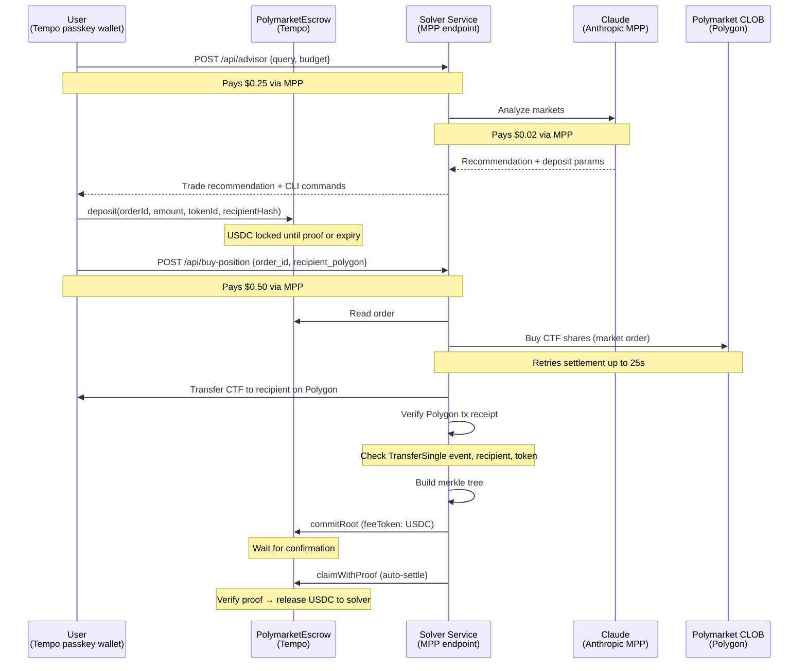

# Solver as a Service

Cross-chain actions, not cross-chain tokens. Pay on Tempo, get a Polymarket position on Polygon. No bridging, no multi-chain wallet. One API call.

The solver buys the position, transfers it to your Polygon address, proves delivery with a merkle proof, and claims settlement from escrow. Fully automated. Neither side trusts the other.

**Live:** [solverasaservice-production.up.railway.app](https://solverasaservice-production.up.railway.app)

## Architecture



## Endpoints

| Method | Path | Cost | Description |
|--------|------|------|-------------|
| GET | `/api/polymarket?q=bitcoin` | 0.10 USDC | Search Polymarket markets |
| POST | `/api/advisor` | 0.25 USDC | LLM market advisor (Claude via Anthropic MPP). Returns recommendation + deposit commands |
| POST | `/api/buy-position` | 0.50 USDC | Fill an escrow order. Buys CTF, transfers, verifies, proves, claims. Full settlement in one call |
| GET | `/api/proof?orderId=0x...` | free | Merkle proof for a fulfilled order |
| GET | `/openapi.json` | free | OpenAPI discovery doc for mppscan/AgentCash |

## Payment Model

| Payment | What | Who pays | How | Amount |
|---------|------|----------|-----|--------|
| Market advice | Claude analyzes markets | User | MPP (our service → Anthropic MPP) | $0.25 |
| Position funds | USDC for CTF purchase | User | Escrow deposit (trustless) | Variable |
| Service fee | Solver orchestration | User | MPP | $0.50 |
| Settlement | Solver claims from escrow | Automated | On-chain merkle proof | Gas only |

Three MPP services chained: user → our advisor → Anthropic Claude → our solver.

## Trust Model

Neither side trusts the other. The user's USDC is locked in escrow on Tempo. The solver can only claim by submitting a merkle proof that passes on-chain verification. If the solver doesn't fill by the deadline, the user calls `refund()`.

**What the proof proves:** The solver constructs a leaf from the escrow order ID and the Polygon tx hash. Before appending to the merkle tree, the service verifies the Polygon transaction receipt: the tx must contain a `TransferSingle` event on the CTF contract, the recipient must match the escrow order, and the correct token must have been transferred. The root is posted on-chain, and `claimWithProof` recomputes the leaf and verifies inclusion. No challenge period. The proof is the settlement.

## Contracts

| Contract | Address | Chain |
|----------|---------|-------|
| PolymarketEscrow | [`0x7331A38bAa80aa37d88D893Ad135283c34c40370`](https://explore.tempo.xyz/address/0x7331A38bAa80aa37d88D893Ad135283c34c40370) | Tempo (4217) |
| CTF (Polymarket) | [`0x4D97DCd97eC945f40cF65F87097ACe5EA0476045`](https://polygonscan.com/address/0x4D97DCd97eC945f40cF65F87097ACe5EA0476045) | Polygon (137) |

## User Flow

Prerequisites: `tempo` CLI installed, `cast` (tempo-foundry) installed, funded Tempo passkey wallet.

### 1. Get a recommendation

```bash
tempo request -X POST --json '{"query":"bitcoin","budget_usd":5}' \
  https://solverasaservice-production.up.railway.app/api/advisor
```

Returns a trade recommendation with `deposit_params` and `next_steps` (ready-to-paste CLI commands).

### 2. Set variables

```bash
# Pull key from logged-in tempo wallet
export USER_KEY=$(tempo wallet whoami -j | jq -r '.key.key')
export USER_WALLET=$(tempo wallet whoami -j | jq -r '.wallet')

# From the advisor response
TOKEN_ID="<yesTokenId from advisor>"
RECIPIENT="<your Polygon address>"
AMOUNT=<amount_raw from advisor>
DEADLINE=$(($(date +%s) + 3600))

# Generate order ID once
export ORDER_ID=$(cast keccak "order-$(date +%s)")
echo $ORDER_ID

# Derived
TOKEN_BYTES=$(python3 -c "print('0x' + hex(int('$TOKEN_ID'))[2:].zfill(64))")
RECIPIENT_HASH=$(cast keccak $RECIPIENT)
```

Run all remaining steps in the same terminal.

### 3. Approve + Deposit

```bash
# Approve
cast send --rpc-url https://rpc.tempo.xyz \
  --tempo.access-key $USER_KEY --tempo.root-account $USER_WALLET \
  --tempo.fee-token 0x20c000000000000000000000b9537d11c60e8b50 \
  0x20c000000000000000000000b9537d11c60e8b50 \
  "approve(address,uint256)" 0x7331A38bAa80aa37d88D893Ad135283c34c40370 $AMOUNT

# Deposit
cast send --rpc-url https://rpc.tempo.xyz \
  --tempo.access-key $USER_KEY --tempo.root-account $USER_WALLET \
  --tempo.fee-token 0x20c000000000000000000000b9537d11c60e8b50 \
  0x7331A38bAa80aa37d88D893Ad135283c34c40370 \
  "deposit(bytes32,address,uint256,bytes32,bytes32,uint256)" \
  $ORDER_ID 0xa0dF29753C297cf0975e55B6bE7516EbB9A94fA9 $AMOUNT $TOKEN_BYTES $RECIPIENT_HASH $DEADLINE
```

### 4. Fill (solver buys, transfers, proves, settles)

```bash
tempo request -X POST --json "{\"order_id\":\"$ORDER_ID\",\"recipient_polygon\":\"$RECIPIENT\"}" \
  https://solverasaservice-production.up.railway.app/api/buy-position
```

This single call: buys CTF on Polymarket → transfers to your Polygon address → verifies the transfer → builds merkle tree → posts root on Tempo → claims from escrow. Full settlement.

### 5. Verify

- CTF tokens in your Polygon wallet
- Escrow order settled on [Tempo Explorer](https://explore.tempo.xyz/address/0x7331A38bAa80aa37d88D893Ad135283c34c40370)

## Merkle Proof Format

```
leaf = keccak256(abi.encodePacked(
    keccak256(abi.encodePacked(orderId, polygonTxHash)),
    orderId
))
```

Binary merkle tree. Proof is concatenated 32-byte sibling hashes. Position (leaf index) determines left/right at each level. Verified on-chain by WithdrawTrieVerifier (59 lines, no dependencies).

## Tech Stack

- **Tempo transactions** via viem (`feeToken`, `writeContractSync` from `viem/chains` tempo chain config)
- **MPP server** via `mppx` (receives payments)
- **MPP client** via `mppx/client` (pays Anthropic for Claude)
- **Passkey wallets** via `tempo wallet` CLI (scoped access keys with spending limits)
- **Polymarket CLOB** via `@polymarket/clob-client` (order placement)
- **Foundry** via `tempo-foundry` fork (contract deployment with `--tempo.fee-token`)

## File Structure

```
contracts/
  src/PolymarketEscrow.sol      Escrow + merkle proof verification (~120 lines)
  src/WithdrawTrieVerifier.sol   Binary merkle proof library (59 lines)
  script/Deploy.s.sol            Foundry deployment script
src/
  lib/fulfillment.ts             Merkle tree, verification, root posting, auto-claim
  lib/polymarket.ts              Gamma API, CLOB client, CTF transfer
  lib/tempo.ts                   Tempo chain config (viem native)
  lib/mpp.ts                     MPP server setup
  app/api/advisor/route.ts       LLM advisor (Claude via Anthropic MPP)
  app/api/buy-position/route.ts  Solver (escrow + direct modes)
  app/api/proof/route.ts         Proof retrieval
  app/api/polymarket/route.ts    Market search
  app/openapi.json/route.ts      OpenAPI discovery for mppscan
  app/page.tsx                   Landing page
scripts/
  test-escrow.ts                 Full e2e test
docs/
  tempo-developer-friction.md    DX issues for Tempo team
  TODO.md                        Known gaps + future work
```

## Future Work

**Position lifecycle.** The solver watches the position and sells at a target price, transferring proceeds back to the user on Tempo. Make money on a foreign chain without ever touching it.

**Agent-to-agent.** An AI agent with a Tempo wallet autonomously searches markets, evaluates odds, deposits into escrow, and triggers the solver. Fully autonomous cross-chain trading.

**Multi-chain.** Same escrow + proof pattern, different target chains. The solver buys anything on any chain. User always pays on Tempo.

## Developer Friction

See [tempo-developer-friction.md](docs/tempo-developer-friction.md) for issues encountered building on Tempo, including viem transaction support, foundry deployment, and Alchemy MPP auth.
