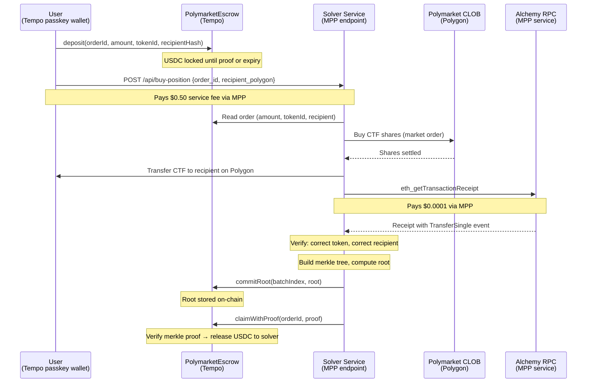
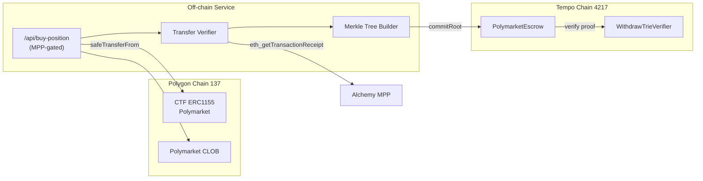

# Cross-Chain Polymarket Solver on MPP

Cross-chain actions, not cross-chain tokens. Pay on Tempo, get a Polymarket position on Polygon. No bridging, no multi-chain wallet juggling. One API call, one payment.

Settlement is cryptographic: the solver proves delivery with a merkle proof verified on-chain. No optimistic challenge period. The verification uses Alchemy via MPP. MPP all the way down.

## Architecture





## Payment Model

| Payment | What | Who pays | How | Amount |
|---------|------|----------|-----|--------|
| Position funds | USDC for CTF purchase | User | Escrow deposit (trustless) | Variable |
| Service fee | Solver orchestration | User | MPP | $0.50 |
| Verification | Polygon tx receipt | Solver | MPP (Alchemy) | $0.0001 |
| Settlement | Solver claims from escrow | Escrow contract | On-chain merkle proof | 0 |

## Endpoints

| Method | Path | Cost | Description |
|--------|------|------|-------------|
| GET | `/api/polymarket?q=bitcoin` | 0.10 USDC | Search Polymarket markets |
| POST | `/api/buy-position` | 0.50 USDC | Buy position via escrow or direct |
| GET | `/api/proof?orderId=0x...` | free | Merkle proof for escrow claim |

## Contracts

| Contract | Address | Chain |
|----------|---------|-------|
| PolymarketEscrow | `0x7331A38bAa80aa37d88D893Ad135283c34c40370` | Tempo (4217) |
| CTF (Polymarket) | `0x4D97DCd97eC945f40cF65F87097ACe5EA0476045` | Polygon (137) |

## Merkle Proof Format

Same leaf format as t1's `T1XChainReader`:

```
leaf = keccak256(abi.encodePacked(
    keccak256(abi.encodePacked(orderId, polygonTxHash)),
    orderId
))
```

The `WithdrawTrieVerifier` library (59 lines, from t1) verifies inclusion against the committed root using position-based binary merkle proofs.

## Quick Start

```bash
bun install
bun dev
```

VPN required (non-US) for CLOB order placement. Polymarket geoblocks US IPs.

## Running the E2E Flow Manually

Prerequisites: `tempo` CLI installed, `tempo-foundry` (cast) installed, dev server running, VPN on.

### Step 1: Search for a market

```bash
tempo request -t -X GET "http://localhost:3000/api/polymarket?q=bitcoin"
```

Pick a market from the results. You need the `yesTokenId` (or `noTokenId`).

### Step 2: Set your variables

All addresses come from `.env` or `.env.local`. You supply the token, recipient, and amount.

```bash
source .env.local

# Pull key from logged-in tempo wallet (no hardcoded PK needed)
USER_TEMPO_PRIVATE_KEY=$(tempo wallet whoami -j | jq -r '.key.key')
USER_WALLET=$(tempo wallet whoami -j | jq -r '.wallet')

TOKEN_ID="<yesTokenId from step 1>"
RECIPIENT="<your Polygon address for CTF delivery>"
AMOUNT=1000000          # $1 in USDC (6 decimals)
DEADLINE=$(($(date +%s) + 3600))   # 1 hour from now

# Generate order ID ONCE. Copy this value - you need it for all remaining steps.
export ORDER_ID=$(cast keccak "order-$(date +%s)")
echo $ORDER_ID

# Derived
TOKEN_BYTES=$(python3 -c "print('0x' + hex(int('$TOKEN_ID'))[2:].zfill(64))")
RECIPIENT_HASH=$(cast keccak $RECIPIENT)
```

**Important:** Run all steps in the same terminal session. `$ORDER_ID` must stay the same from deposit through claim.

### Step 3: Approve USDC to escrow

```bash
cast send --rpc-url $TEMPO_RPC_URL \
  --tempo.access-key $USER_TEMPO_PRIVATE_KEY \
  --tempo.root-account $USER_WALLET \
  --tempo.fee-token $USDC_TEMPO \
  $USDC_TEMPO "approve(address,uint256)" $ESCROW_ADDRESS $AMOUNT
```

### Step 4: Deposit into escrow

```bash
cast send --rpc-url $TEMPO_RPC_URL \
  --tempo.access-key $USER_TEMPO_PRIVATE_KEY \
  --tempo.root-account $USER_WALLET \
  --tempo.fee-token $USDC_TEMPO \
  $ESCROW_ADDRESS "deposit(bytes32,address,uint256,bytes32,bytes32,uint256)" \
  $ORDER_ID $SERVICE_WALLET_ADDRESS $AMOUNT $TOKEN_BYTES $RECIPIENT_HASH $DEADLINE
```

### Step 5: Call the solver (pays $0.50 MPP service fee)

```bash
tempo request -X POST --json "{
  \"order_id\": \"$ORDER_ID\",
  \"recipient_polygon\": \"$RECIPIENT\"
}" http://localhost:3000/api/buy-position
```

The solver reads the escrow order, buys CTF on Polymarket, transfers to your Polygon address, verifies the transfer, builds a merkle tree, and posts the root on Tempo.

### Step 6: Get the proof

```bash
curl "http://localhost:3000/api/proof?orderId=$ORDER_ID"
```

Returns `{ batchIndex, position, proof, polygonTxHash, root }`.

### Step 7: Claim from escrow (solver settles)

```bash
# Use values from step 6
cast send --rpc-url $TEMPO_RPC_URL \
  --private-key $RELAYER_PRIVATE_KEY \
  --tempo.fee-token $USDC_TEMPO \
  $ESCROW_ADDRESS "claimWithProof(bytes32,uint256,uint256,bytes32,bytes)" \
  $ORDER_ID <batchIndex> <position> <polygonTxHash> <proof>
```

Escrow verifies the merkle proof on-chain and releases USDC to the solver.

### Step 8: Verify

- Check your Polygon address on Polygonscan: CTF tokens received
- Check Tempo explorer: escrow order settled
- Check solver balance: USDC received

### Automated

All steps above are automated in the test script:

```bash
bun run scripts/test-escrow.ts
```

## Accounts

| Role | Address | Type |
|------|---------|------|
| User | `0xEF0726eBc08C1f89DEdF559163B7eC367C98C857` | Tempo passkey wallet |
| User (scoped key) | `0x3Fec086381Ada1FdA646a3338739440f2F8276f9` | $100 spending cap, 30-day expiry |
| Solver | `0xa0dF29753C297cf0975e55B6bE7516EbB9A94fA9` | EOA on Polygon + Tempo |

## File Structure

```
contracts/
  src/PolymarketEscrow.sol      Escrow + merkle proof verification
  src/WithdrawTrieVerifier.sol   Binary merkle proof library (from t1)
src/
  lib/fulfillment.ts             Merkle tree builder, root poster, transfer verification
  lib/polymarket.ts              Gamma API, CLOB client, CTF transfer
  app/api/buy-position/route.ts  MPP-gated solver (escrow + direct modes)
  app/api/proof/route.ts         Proof retrieval
  app/api/polymarket/route.ts    Market search
scripts/
  test-escrow.ts                 Full e2e test
docs/
  demo-runbook.md                Step-by-step demo commands
  tempo-developer-friction.md    DX issues for Tempo team
  TODO.md                        Known gaps
```

## Proven E2E Flow

Tested on Tempo mainnet + Polygon mainnet, 2026-03-18:

| Step | Tx |
|------|----|
| Escrow deposit | Tempo |
| CTF purchase | Polymarket CLOB order `0x3820...` |
| CTF transfer | [Polygon `0x9896...`](https://polygonscan.com/tx/0x9896ada0ea4ba45d7cf10cc2b699f5e307ca63635438627806fa574690d57b5e) |
| Root committed | Tempo (batch 1, root `0x5258...`) |
| Claim with proof | Tempo (order settled ✓) |

## Future Work

Full position lifecycle management. The solver watches the position and sells at a target price, transferring proceeds back to the user on Tempo. Make money on a foreign chain without ever touching it.

LLM-powered market discovery. An agent searches markets, evaluates liquidity and pricing, and constructs the deposit intent for the user to sign. The agent uses MPP to search, MPP to fill, and MPP to verify.

## Developer Friction

See [tempo-developer-friction.md](docs/tempo-developer-friction.md) for issues encountered building on Tempo, including viem transaction support, foundry deployment, and Alchemy MPP auth.
